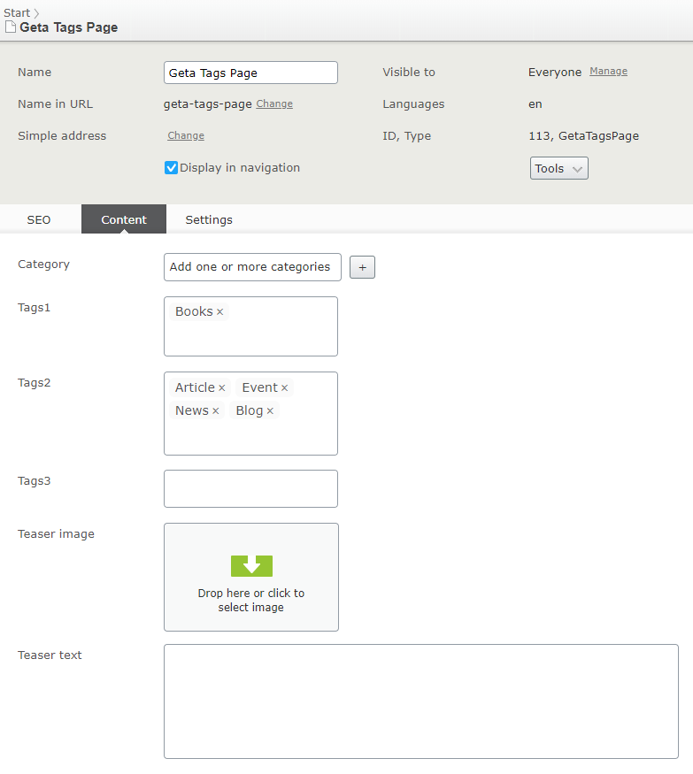
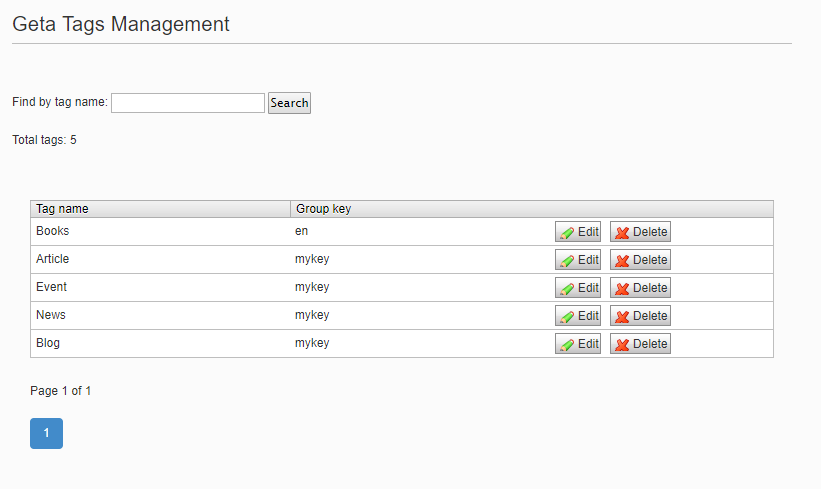
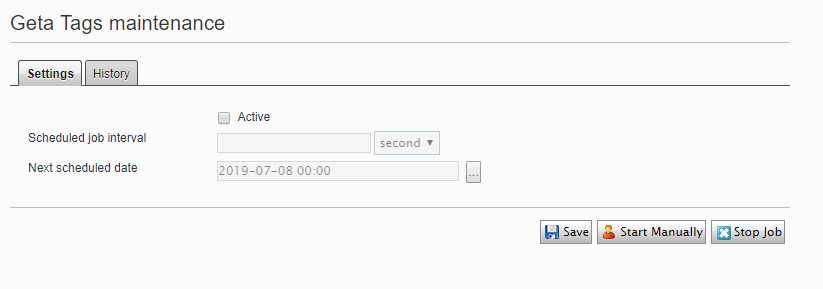

# Editor guide

## Tags property

Once the developer installed the package and defined a Tags property on a page or block the property will appear in the CMS. In the text field, a tag can be typed. After pressing enter the tag is created. By clicking the 'x' the tag is removed.

## Geta Tags Management

In the admin mode, a new plugin is available under the 'tools' menu section. The management view provides the ability to search, modify and delete a tag.

## Geta Tags maintenance scheduled job

- fix tag - content relations

